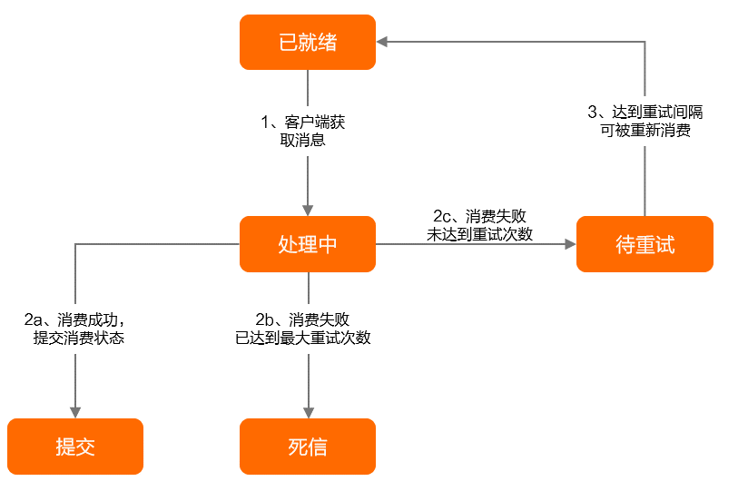

### RocketMQ 相关

#### 消息属性
* [RocketMQ版中消息（Message）](https://help.aliyun.com/document_detail/440345.html)
* 系统保留属性
  * Topic，一般相同消息类型的使用同一个Topic
  * 消息类型，Normal/FIFO/Delay/Transaction
  * 消息ID，由系统生成
  * 索引Keys，一般存业务的唯一ID，用作幂等校验
  * 标签Tag，只能设置一个，消费者可以拉取指定Tag的消息
  * 定时时间
  * 消费重试次数，每次重试会自增
* 业务自定义属性，键值对
* 消息负载，消息的body

#### 消息重试
* [消费重试](https://rocketmq.apache.org/zh/docs/featureBehavior/10consumerretrypolicy)
* 消费重试策略有两种，它们的最大重试次数都是消费者分组创建时的元数据控制：
  * PushConsumer，重试间隔是预定义的坡度表
  * SimpleConsumer，消费者消费时指定InvisibleDuration，超时未ack成功则重试
* 死信队列的消息默认不能被消费者消费，但可以在控制台重新发送它，给消费者消费

